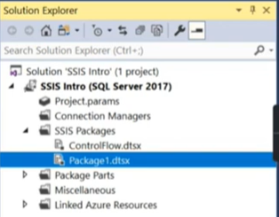

Hierarchy:
Solution -> Projects -> Packages 

 
Packages are like workspaces for flows in Alteryx
.dts -> data transformation services file
Miscellaneous folder -> other things not related to the flow 
 
Connection Managers -> manage the sources of you connections
 
**control flow**
tools:
- data flow task -> move data from one source to another

 
Basic transformations:

- Derived Column
- Data Conversion
- Copy Column
- Character Map
- Sort

**Data Conversion**
- varchar(String DT_STR), nvarchar(Unicode String DT_WSTR)

**Data Viewer**
- debugging, shows data at certain step

**Execute SQL task**
- custom query in control flow

**Derived Column**
- use functions to alternate, create columns on existing columns

**Character Map**
- functions regarding the value like UPPER()

**Sort**
- like order by

**Multicast**
- multiple sources or destinations